# Self-RAG & Corrective RAG System for the Indian Constitution & IPC

An advanced, agentic Retrieval-Augmented Generation (RAG) system utilizing **LangGraph** to implement Self-RAG and Corrective RAG (CRAG) patterns. It provides highly reliable question-answering over the **Constitution of India** and the **Indian Penal Code (IPC)**.

The system dynamically decides between internal database retrieval, web search fallback, and direct generation, incorporating validation checks for context relevance, answer grounding, and utility to rewrite queries and self-correct when necessary.

---

## 🗺️ Workflow Architecture

Below is the complete state machine representing the LangGraph workflow:

```mermaid
flowchart TD
    %% Styling definitions
    classDef startEnd fill:#d4edda,stroke:#28a745,stroke-width:2px,color:#155724;
    classDef decision fill:#fff3cd,stroke:#ffc107,stroke-width:2px,color:#856404;
    classDef process fill:#e8f4fd,stroke:#17a2b8,stroke-width:2px,color:#0c5460;
    classDef loopNode fill:#f8d7da,stroke:#dc3545,stroke-width:2px,color:#721c24;

    %% Nodes
    Start([START]):::startEnd
    End([END]):::startEnd

    DeciderNode[retrieval_decider_node<br>Analyze query & determine route]:::process
    DeciderCond{Retrieval Decider Route?}:::decision

    DirectNode[direct_generation_node<br>Generate answer directly from LLM]:::process

    GenRetrieverQueryNode[generate_retriever_query_node<br>Optimize query for vector search]:::process
    RetrieveNode[retrieve_node<br>Query FAISS vector store]:::process

    Fanout[fanout_relevant_node<br>Parallel Map: Split contexts]:::process
    IsRelevantNode[is_relevant_node<br>Check context relevance to query]:::process
    AggregateNode[aggregate_relevance<br>Reduce: Consolidate relevance results]:::process
    IsRelevantCond{Are any retrieved<br>contexts relevant?}:::decision

    GenWebSearchQueryNode[generate_web_search_query_node<br>Optimize query for web search]:::process
    WebSearchNode[web_search_node<br>Search web via Tavily API]:::process

    AnswerFromContextNode[answer_from_context_node<br>Synthesize answer using context]:::process

    CheckAnswerGroundedNode[check_answer_grounded_node<br>Verify answer is grounded in context]:::process
    IsGroundedCond{Is Answer Grounded &<br>Has Revise Retries?}:::decision

    ReviseAnswerNode[revise_answer_node<br>Refine answer using critic model]:::process

    IsAnswerUsefulNode[is_answer_useful_node<br>Judge if answer solves the query]:::process
    IsUsefulCond{Is Answer Useful &<br>Has Rewrite Retries?}:::decision

    RewriteQueryNode[rewrite_query_node<br>Reframe user query & decrement retry count]:::loopNode

    %% Connections
    Start --> DeciderNode
    DeciderNode --> DeciderCond

    DeciderCond -- "None" --> DirectNode
    DeciderCond -- "retrieval" --> GenRetrieverQueryNode
    DeciderCond -- "web_search" --> GenWebSearchQueryNode

    DirectNode --> End

    GenRetrieverQueryNode --> RetrieveNode
    RetrieveNode --> Fanout
    Fanout -- "Send (Parallel Execution)" --> IsRelevantNode
    IsRelevantNode --> AggregateNode
    AggregateNode --> IsRelevantCond

    IsRelevantCond -- "Yes" --> AnswerFromContextNode
    IsRelevantCond -- "No" --> GenWebSearchQueryNode

    GenWebSearchQueryNode --> WebSearchNode
    WebSearchNode --> AnswerFromContextNode

    AnswerFromContextNode --> CheckAnswerGroundedNode
    CheckAnswerGroundedNode --> IsGroundedCond

    IsGroundedCond -- "Yes" --> IsAnswerUsefulNode
    IsGroundedCond -- "No" --> ReviseAnswerNode
    ReviseAnswerNode --> IsAnswerUsefulNode

    IsAnswerUsefulNode --> IsUsefulCond
    IsUsefulCond -- "Yes" --> End
    IsUsefulCond -- "No" --> RewriteQueryNode
    RewriteQueryNode --> DeciderNode
```



---

## 🚀 Key Features

1. **Intelligent Query Routing (`retrieval_decider_node`)**: Evaluates if the query is a general knowledge question (`None`), requires constitutional/IPC lookup (`retrieval`), or concerns recent happenings/un-indexed details (`web_search`).
2. **Multi-Query Retrieval (`generate_retriever_query_node` & `retrieve_node`)**: Generates optimized search queries to ensure comprehensive fetching from the FAISS database.
3. **Parallel Relevance Verification (`fanout_relevant_node` & `is_relevant_node`)**: Distributes retrieved documents in parallel (Map step) to score and filter irrelevant content, and combines them (Reduce step) to clean up noise.
4. **Web Search Fallback (`web_search_node`)**: Integrates the Tavily Search API as a backup when local retrieval fails to find relevant context.
5. **Hallucination & Grounding Check (`check_answer_grounded_node`)**: Grades the synthesized answer against the retrieved evidence. If the answer is ungrounded, it invokes `revise_answer_node` to regenerate using a critic model.
6. **Goal-Driven Query Rewriting (`rewrite_query_node`)**: If the final response is judged non-useful (in `is_answer_useful_node`), it rewrites the initial user query and restarts the RAG process (up to a configured limit of retries).
7. **Thread-Based Memory (`SqliteSaver`)**: Persists chat history across sessions using SQLite state checkpointers.

---

## 📁 Repository Structure

*   **`src/workflow/`**: The core graph package.
    *   `__init__.py`: Combines state, nodes, and conditional edges into the compiled `StateGraph`.
    *   `state.py`: Defines the `schema` (TypedDict) that maintains the shared workflow variables.
    *   `nodes.py`: Houses logic for all graph states, invoking the underlying LLMs, Tavily tools, and vector stores.
    *   `edges.py`: Logic for conditional routing (decider route, relevance, grounding, and utility).
    *   `config.py`: Loads credentials and defines model components (using Ollama and HuggingFace).
    *   `prompts.py`: Holds system instructions for evaluation, generation, revision, and rewriting.
    *   `schemas.py`: Implements Pydantic parser schemas for structured JSON output.
*   **`src/create_vector_store.py`**: Ingestion script that parses raw article and section files and saves them as a FAISS database.
*   **`src/cli.py`**: Interactive terminal shell utilizing `rich` for pretty printing and real-time step streaming.
*   **`data/`**: Directory containing raw JSON datasets and FAISS database files.

---

## 🛠️ Setup & Installation

### 1. Prerequisites
- Python 3.12 or higher.
- [uv](https://github.com/astral-sh/uv) (recommended) or `pip` for managing dependencies.

### 2. Install Dependencies
Run the following command in the project root:
```bash
uv sync
```
*Or using traditional pip:*
```bash
pip install -r pyproject.toml
```

### 3. Environment Variables
Create a `.env` file in the root directory (or update the existing one) with your API keys:
```env
LANGSMITH_TRACING_V2="true"
LANGSMITH_ENDPOINT="https://api.smith.langchain.com"
LANGSMITH_API_KEY="your-langsmith-api-key"
LANGSMITH_PROJECT="constitution"
TAVILY_API_KEY="your-tavily-api-key"
OLLAMA_API_KEY="your-ollama-api-key"
```

### 4. Create the Vector Store
To ingest the Indian Constitution and Penal Code data into the local FAISS index:
```bash
python src/create_vector_store.py
```
*(This parses raw inputs from `data/articles.json` and `data/penal_code_sections.json` and compiles them under `data/constitution_and_ipc.faiss`).*

---

## 💬 Usage

Launch the interactive console with the CLI script:
```bash
python src/cli.py
```

### Special Commands inside CLI:
- `/new`: Resets the chat history and spawns a new conversation thread.
- `exit`: Shuts down the interactive loop.
